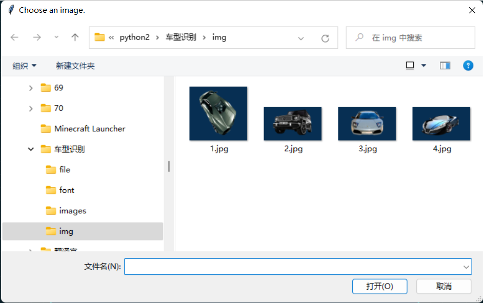
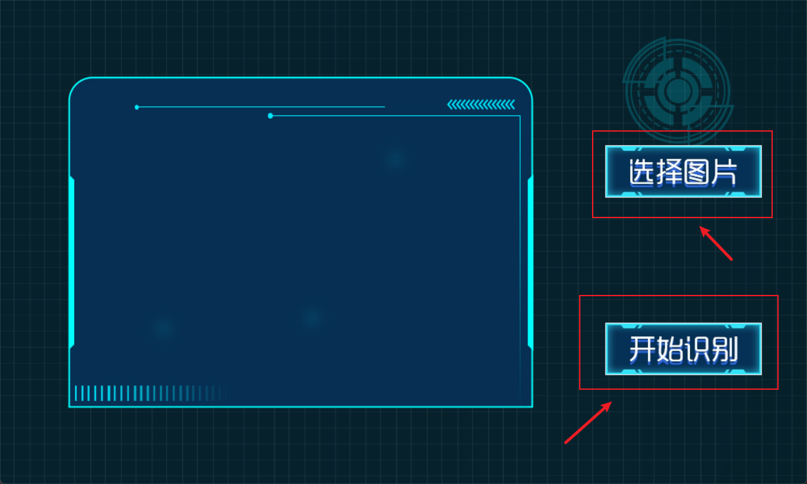

# 车型识别🚗

效果图


<br/>

# 原理🔬

我自己制作的python客户端和百度识别服务器连接一起，打开客户端、点击选择图片、选择图片后点击开始识别，客户端会把这个图片加密，然后把这个图片上传到百度识别服务器，然后百度服务器会把这个图片进行解密，百度服务器会根据这个车辆照片找相似点，然后把数据传回到客户端，把这些数据解析并公布在图形界面客户端

<br/>

# 代码

### 模块导入

```python
import tkinter as tk
from tkinter import filedialog
from PIL import ImageTk
import requests
import json
import base64
import os
```

==注意：tkinter 和 PIL 需要你自己导入==

- #### 模块导入方法

打开cmd

输入这两行代码

```
pip install tkinetr
```

```
pip install pillow
```

<br/>

### 请求服务器的key（别问我为什么不提供）

```python
apiKey = '填你自己的key'
secretKey = '填你自己的key'
```

<br/>

### 解析数据

```python
def getToken():
    getTokenUrl = 'https://aip.baidubce.com/oauth/2.0/token?grant_type=client_credentials&client_id='+apiKey+'&client_secret='+secretKey
    response = requests.get(getTokenUrl)
    data = response.json()
    token = data.get('access_token')
    return token
```

<br/>

### 核心主要部分

```python
# 创建函数getData
def getData():
    #地址
    url = 'https://aip.baidubce.com/rest/2.0/image-classify/v1/car'
    #图片编码
    with open(imagePath,'rb') as f:
        image = f.read()
    b64Image = base64.b64encode(image)
    print(b64Image)
    #获取车辆信息
    params = {'access_token':getToken()}
    data = {'image':b64Image}
    response = requests.post(url,params=params,data=data)
    content = response.json()
    result = content['result']
    print(result)
    #写入数据并跳转页面
    result = json.dumps(result)
    with open("file/info.txt",'w',encoding='utf-8') as f:
        f.write(result)
    window.destroy()
    #跳转到该目录的index2.py
    os.system('python index2.py')
```

<br/>

### 实现图片选择

```python
def chooseImage():
    global imagePath
    imagePath = filedialog.askopenfilename(initialdir="./img",title='Choose an image.')
    carImg = ImageTk.PhotoImage(file=imagePath)
    car = tk.Label(window,width=367,height=275,image=carImg)
    car.place(x=185,y=160)
    window.mainloop()
```

#### 效果图



<br/>

### 创建窗口绘制背景

```python
#创建窗口绘制背景
window = tk.Tk()
window.geometry('1000x600') #窗口默认大小
window.resizable(0,0) #锁定窗口大小改变
window.title('车型识别') #窗口标题
bgImg = ImageTk.PhotoImage(file="images/bg1.jpg")
bg = tk.Label(window,width=1000,height=600,image=bgImg)
bg.pack()
```

<br/>

### 分别添加 “选择图片” 和 “开始识别” 按钮

#### “选择图片” 按钮

```python
selectImg = ImageTk.PhotoImage(file="images/select.jpg")
select = tk.Button(window,image=selectImg,bd=0,width=192,height=63,command=chooseImage)
select.place(x=750,y=180)
```

#### “开始识别” 按钮

```python
okImg = ImageTk.PhotoImage(file="images/ok.jpg")
ok = tk.Button(window,image=okImg,bd=0,width=192,height=63,command=getData)
ok.place(x=750,y=400)
```

#### 效果图



<br/>

### 别忘了加上这个

```python
window.mainloop()
```
